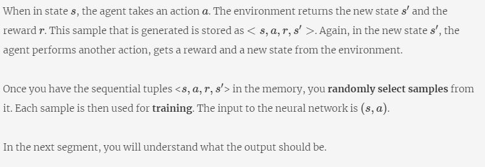
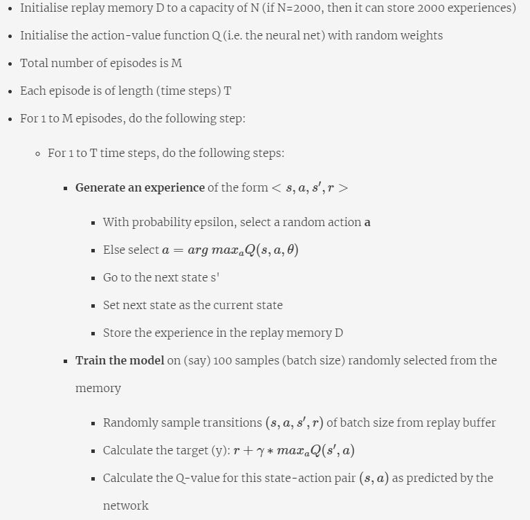

# DeepQ-Learning

## Introduction
Welcome to the module on **Deep Reinforcement Learning**.  In classical reinforcement learning, you learnt about the agent-environment interaction, Markov Decision Process, dynamic programming, Monte Carlo methods and Q-learning.  

When the state space is relatively small, e.g. a 3x3 grid, or even a few thousand states etc., it is easy to visit each and every state and estimate its Q-value. However, when the state space is large, visiting every space may not be possible. So, the classical approach of estimating the Q-value by visiting each state-action pair wouldn't work.

DeepMind's [AlphaGo recently defeated the 18-time world champion Lee Sedol 4-1](https://www.wired.co.uk/article/alphago-deepmind-google-wins-lee-sedol) in a historic match. Go](https://en.wikipedia.org/wiki/Go_(game)) is an extremely complex board game : the number of possible 'states' in Go is more than the number of atoms in the universe! You can [watch the trailer of a documentary on AlphaGo here](https://www.youtube.com/watch?v=8tq1C8spV_g).

 The algorithm used to train AlphaGo was based on deep reinforcement learning. 

 Let's take another example : suppose you are training a robotic arm to play table [tennis](https://www.youtube.com/watch?v=SH3bADiB7uQ). How many positions (**states**) the arm can take in the space? Infinite, right? These positions will be guided by the position of the ball. The task of the robotic arm is to hit the ball. There can be infinite possible angles (the **actions**) to hit a ball in any given position. How will you decide the optimal action for each of these positions? By visiting each state-action pair and storing its Q-value? But there are infinite state-action pairs and you can not possibly visit ALL of them!

 This is where deep learning comes in. Using deep learning, instead of finding the Q-value for every state, you **learn** the Q-function or policy etc. This is very similar to what you do in supervised machine learning. From a few hundred thousand samples, you learn a model to label the unseen samples.

 In this module, you will learn to apply deep learning to reinforcement learning problems. Specifically, two techniques will be covered: deep Q-learning and policy gradients. In deep Q- learning, the basic equation to update the Q-values will remain the same. However, you will apply deep learning to learn the Q-function.

 ### Why Deep Reinforcement Learning?
In classical reinforcement learning, you make a Q-table representing all possible states. What happens if the agent encounters an unseen state? This unseen state would not be present in the Q-table. So, it would not have associated Q-values for each action. In such a case, you would not be able to decide the optimal action from the Q-table.

Let's take the example of a self-driving car.

In a self-driving car, if the state is represented by (position of the vehicles, number of vehicles on the road), the agent will always encounter new states, no matter how many states it has already seen. The Q-table will not have all possible (unseen) states, so you would not be able to estimate the best action for these states the regular RL way.

Let's see how to solve this problem.

When you have a very large state-space, the agent may not be able to visit each state because the state-space is too large. In the Q-table, if a particular state is not present, you would not know which action should be taken, and hence, cannot find optimal action for an unvisited state.

Also, to learn these functions, it is not necessary (in principle) to use deep learning models - you can use conventional machine learning models as well. However, since deep learning models can learn arbitrarily complex functions, in practice they prove to work much better.

In this module, you will use **deep learning** to learn the state-action value function (or the q-function).

### Parameterised Representation
You saw that when the number of states is large, creating a 'Q-table' by visiting each state-action pair is not feasible. Thus, you try to **approximate the Q-function**. Let's see how this is done.

Thus, in the parametrised approach, the Q-function is represented as 

Recollect that the parameters of a deep learning model are basically the weights (and biases). In other words, a **deep learning model is parametrised by its weights** which are learnt during training.

Atoms in Universe(https://www.universetoday.com/36302/atoms-in-the-universe/)

### Generalizability in Deep RL
In deep reinforcement learning, you model the action-value function (or the policy or the value function) using the function approximator based on the 'seen' states. It becomes important that the model performs well on the 'unseen' states.

For example, say you are training an autonomous car. The car will be trained in certain traffic conditions and would be exposed to certain states, but it should be able to perform in new, unseen states as well.

A function approximator should be able to **generalise well on the unseen states**.

The model should be able to 'generalise' and take optimal actions on the states that the agent has not encountered before, assuming that the training dataset and the unseen dataset come from the same distribution.

For example, if you are playing table tennis with a robotic arm, the arm has to hit the ball for all possible positions of the ball (and not just for the positions of the ball it has learned during training).

So, the function approximator should be able to 'generalise' to unseen data points. Given some 'seen' states, it should be able to predict the optimal action for the 'unseen' positions of the ball. This property is valid for any (well-trained) model in machine learning. 

We will use a neural network for approximating these functions: state-value, action-value, policy etc. As pointed out, we can use other algorithms as well: decision trees, SVM etc., but in practice, the complexity of most RL tasks require deep neural networks.

Let's now see some of the widely used methods to solve deep RL problems.

The first successful demonstration of deep RL at par with the human-level performance was playing Atari games by DeepMind. The screenshots of the game were taken. Each screenshot represented a state. Each state was then passed to the deep reinforcement learning network.

Broadly, there are three classes of deep RL:
1. **Deep Q-learning?** : value-based
    * The task is to learn the state (or state-action) value function
2. **Policy Gradient** : policy-based
    * The task is to learn the policy function
3. **Actor-Critic** : both value and policy based
    * The task is to learn both the state-value function and the policy function, and so these methods use **two neural networks**. The actor (policy-based) takes the action and the critic (value-based) tells how good that action is.  

You know that neural networks are powerful function approximators and can approximate any complex function. The parameters of the neural network are the weights and the biases.

**Please note that** in this course only deep Q-learning is covered in detail. For those who are interested, **policy gradient and actor-critic methods are provided as optional sessions** in the module.

### Deep Q Learning
**Note**: Before proceeding, it is important that you understand what an [independent identical distribution (IID)](https://en.wikipedia.org/wiki/Independent_and_identically_distributed_random_variables) is.

When you train a machine learning model, such as linear regression, you assume that the data points are **independent and identically distributed (IID)**. For example, say you are using regression to predict the price of a house using its area, so you have (area, price) tuples as your training data. You assume that **each data point is independent** of each other (the price of a house does not affect that of another) and that all the data points are identically distributed. 

An **identical distribution** means that every time you draw a data point, whether you draw the first or the 100th data point, the probability of getting a particular data point is the same. For e.g. say there is a house with a large area (say 20,000 sq. ft.) and a very high price. Now, imagine that you create your training set by drawing data points from some probability distribution of (area, price). No matter which data point you are drawing - the probability of this (and any other house) appearing is the same.

**Food for thought**: Say you learn the action-value function using (say) Q-learning, i.e. the agent learns various (state, action, expected reward) triplets by simulating some episodes. Are these triplets IID.?

In the following segments, let's see how neural networks fit into the deep RL framework and discuss some important issues involved in these models.

To summarise, the neural network acts as a function approximator that approximates the Q-value function. It could be a multilayer perceptron, a convolutional neural network etc. depending on the problem. The arguments to the neural network for deep Q-learning are as follows:
* The (state, action) pair is the **input** - it will be a concatenation of state and action
* Corresponding to each (state, action) pair, a state-action value Q(s, a) is the **output** - the expected reward (Q-value) for the given state, corresponding to the action you perform

Thus, a typical (Q-value based) neural network in deep RL learns to solve a **regression problem**.

However, there is a catch - the data samples, when training the neural network, should come from an independent and identical distribution which is not strictly the case in RL. The samples are not independent because **the next state is usually highly dependent on the previous state and action**. 

For example, let's say an agent is trying to learn to play an Atari video game. The state is represented by the screenshot of the game at any point. As you move from one screenshot to the next, there will be little change in pixel values. Hence, the next state (screenshot) is **dependent** on the previous one.

The other problem is that of **identical distribution**. We said that an **identical distribution** means that every time you draw a data point, whether you draw the first or the 100th data point, the probability of getting a particular data point is the same.

Now, this is not the case in deep RL - the probability of a (state, action, reward) triplet appearing changes with 'time' (i.e. episodes). That is, say you are creating a training set of 1 million (state, action, reward) triplets. Towards the start, the agent has not learnt much, so the probability of a (s, a, r) triplet will be very different from when the agent has learnt much more during the end of the game.

The Deep Q-Network algorithm is significant because it managed to solve these problems. You will study the Deep Q-Network algorithm in detail in the upcoming segments. 

Please note that policy gradient and the actor-critic methods have been covered as optional sessions in the module.

### Training in Deep Reinforcement Learning
Let's say that you initialise a neural network that can approximate the Q-value for a given (state, action) pair. Let's see how you would train such a network.

The state is represented by 4 values and there are 2 actions possible in each state.

### Replay Buffer

How many experiences should you store in the memory? This is a hyperparameter and can be tuned to make the training process faster.

Why do you need to store the agent-environment interaction in the memory (replay buffer)? Let’s understand this in the following segment. 

To train the neural network, you need to have the data mimicking the interaction between the agent and the environment so that the neural network can 'learn' from that interaction and see what actions are rewarded positively. The agent-environment interaction generates the training data set for the neural network.

A neural network is trained in batches in which the data points are random (IID). But the agent's experience is generated **sequentially**, i.e. you go from one state to another state in a sequential, dependent fashion. So, to make a batch from a sequential process, you store them in memory and take **random samples** of batch size to train the network.

### Generate Data for Training
Broadly, there are two steps involved while building a deep reinforcement learning model:
1. First is to **generate the data** required for training
2. Second is to **train the neural net** on the generated data to get the optimal Q-value function
 
How do you **generate the data**?

### Target in DQN

In the following segment, we will explain the DQN algorithm further.

### When to Stop Training?

Recall that both predicted and target (or ground truth) values are improving over time during training. Will they ever come 'close enough'? 

Let's now discuss the criteria for stopping the training process.

The predicted and the target values are improving over time as the Q-function gets better after each gradient update. This will give better rewards with each time step. For example, let's say that the predicted Q-value you get from the network is 20 and the expected value is 30. After training for a few time steps, you will get the predicted value as 27, but the target value could also increase to 35.

This type of situation will come in the initial stage of training, but after training for sufficient time, the network will stabilise. The parameters of the neural network will not change significantly, and that is when you can stop training further.

The time required to train is a hyperparameter and depends on the Markov Decision Process (MDP), layers in the neural network, etc. 

### Comprehension - Training pseudo code
The deep Q-learning pseudocode is as follows:

### Comprehension - Cartpole Game

Consider the game of CartPole-v0. There is a pole which is attached, by an un-actuated joint, to a cart. The cart moves along a frictionless track. The system is controlled by applying a force of +1 or -1 to the cart (the black rectangle in the below diagram). There are two actions [**Push the cart to the left, Push the cart to the right**] that can be performed in each state. The pendulum starts upright, and the goal is to prevent it from falling over.
 
A reward of +1 is provided for every timestep that the pole remains upright or is within 15 degrees from the vertical. The episode ends when the pole is more than 15 degrees from vertical, or the cart moves more than 2.4 units from the centre.

A state is represented by the following four components (food for thought : is this a valid Markov state?):

**State(4 values)**: [Position of the cart, Velocity of the cart, Angle of the pole, Angular rate of the pole]

**Action(2 possible actions)**: [Push cart to the left, Push cart to the right]. It will be represented as [1, 0] and [0, 1]. 

**Episode:**
Let's assume that each episode is of length 500. That is, if the CartPole can be balanced for 500 timesteps within 2.4 units from the centre, the episode ends automatically.

**Next Episode**: Although the CartPole can be balanced for a maximum of 500 timesteps, during training, it may fall before completing full 500 steps. It can be 20, 50, 100 etc. So, when the pole falls, the next episode will start. 

**Reward**:
A reward of +1 for every timestep the pole is up and within 2.4 units from the centre. So the maximum reward can be 500. Also, if the agent is not able to complete 500 timesteps, it will receive a reward of -100 at the last timestep in an episode. 

**Memory (Replay buffer):**
Let the size of the memory be 1000. This means that you can store 1000 experiences in memory.

**Model:**
There are 4 values in each state and two actions possible per state. Thus, 'state' is a vector of length 4, such as [0.1, 2.4, 2.2, 1.0] while an action is one of the two vectors [1, 0] or [0, 1]. We feed a concatenation of the two vectors to the network.

**How to get the Q-value:**
Suppose you are at a certain state 's', and you want to pick the second action out of the two possible actions. What will be the input?

Let the state be some random vector [2.5, 3.4, 5.2, 9]. If you choose the second action, then the action vector will become [0, 1]. The net input to the neural network will be [2.5, 3.4, 5.2, 9, 0, 1] corresponding to states and the action. 

![title])(img/genrating_samples.JPG)

### Atari Game
In the following segment, you will learn the algorithm that was used to train the breakthrough Atari Breakout game. Through this example, you will also see how to define a 'state' when you are playing a graphical game such as a typical Atari game.

The DQN was initially designed to play the Atari family of video games. You can play the game Breakout [here](https://elgoog.im/breakout/). The states are basically the screenshots of the game, and hence, each state is an array of pixels. The actions are all the possible actions that you can take in the game. In Breakout, there are three possible actions in each state - move left, move right or do not move at all. Also, you need to pre-process the images (screenshots), instead of directly passing the raw pixels through the deep Q network (DQN).

Let’s understand the pre-processing step in the following segment.

You already know that Convolutional Neural Networks (CNNs) are widely used in image-related tasks. Because of their architecture, they help in extracting useful features from images. In deep Q-networks, CNNs are used to extract a feature representation of the raw pixels of the state screenshots. These extracted features along with the action then go as the input to the neural network.

### Pre-processing in Atari
Suppose you are playing the Atari game 'Breakout'. The dimensions of each state's snapshot are 84 x 84 pixels. In the DQN paper, the author has defined a state as **4 consecutive snapshots**. Hence, the state is of dimension 84 x 84 x 4. To extract a feature representation of the snapshot, you can use a few convolutional layers (to do preprocessing as defined in the paper) which has a flattening layer towards the end. The flattening layer will produce a feature vector corresponding to the raw screenshot(s).

After this, you can train the deep reinforcement learning network as discussed.

**Additional Resources:**
[Playing Atari with Deep Reinforcement Learning](https://arxiv.org/pdf/1312.5602.pdf) - This is the paper that the professor has referred to in the video above.

